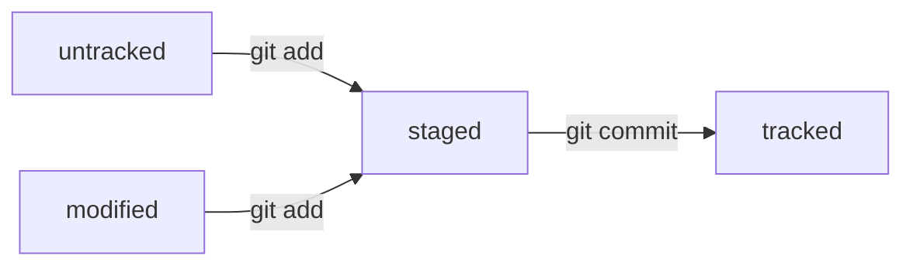
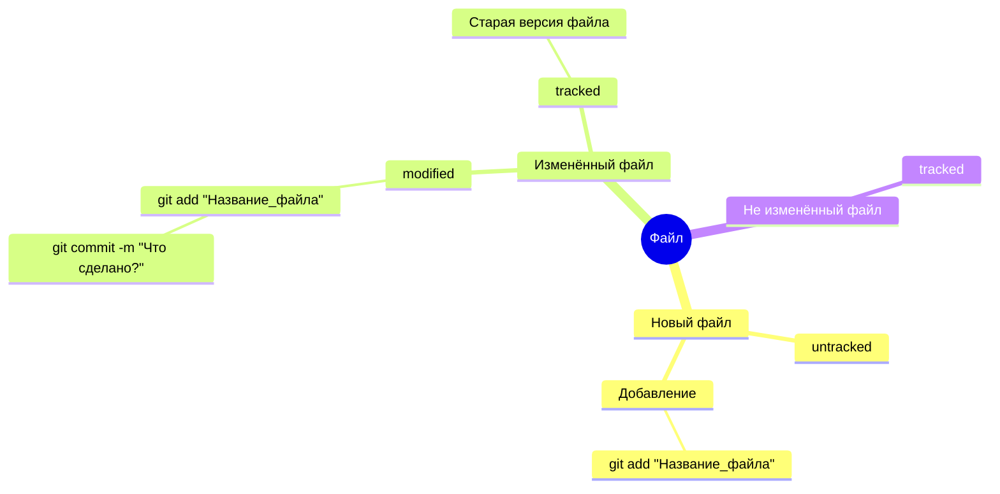
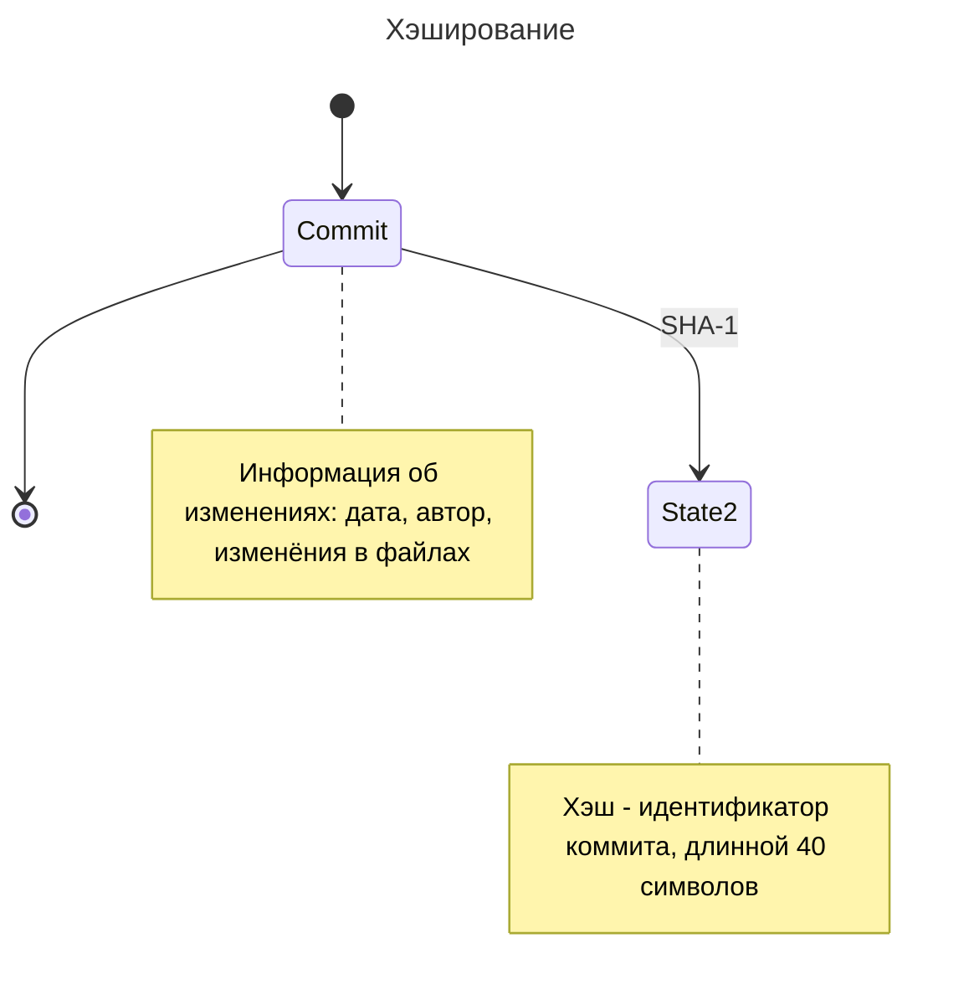

# Hey, it's cool tips for `Git`
---
[](https://nodesource.com/products/nsolid)
1. Используйте __Git__ для управления версиями проекта локально
2. Синхронизируйте локальные проекты с различными репозиториями, такими как __GitHub__
3. Работайте на проектом в команде

## Создание и подключение
##### Рассмотрим все шаги детально:
---
### На __windows__ локальные репозитория могут храниться тут:
```bash
cd ~/source/repos/
```
##### -🗂️ Тут обычно храняться все локальные репозитории __Git__
[](https://postimg.cc/ftVqsrr1)

### Инициализация крутого репозитория
```bash
git init
```
##### - 🗺️ Команда выполняется непосредственно в начальной директории проекта

### 💾 Добавим файлы с изменениями, это как __ctrl+c__
```bash
git add [Название_файла | .]
```

### 🔗 Объеденим все изменения
```bash
git commit -m "Что объединяет изменения?"
```

### Поделимся актуальной версией с удалённым репозиторием
```bash
git push
```

#### ⚠️ Первое добавление на __GitHub__
>  Если на удалёном репозитории ещё пусто, тогда `git remote add origin [git@github.com:username/Имя_репозитория.git]`
>  Затем, `git push -u [master | main]`

# Статусы файлов
---





# __HEAD__ && __HASH__
---


**Author: a1ndreay**
