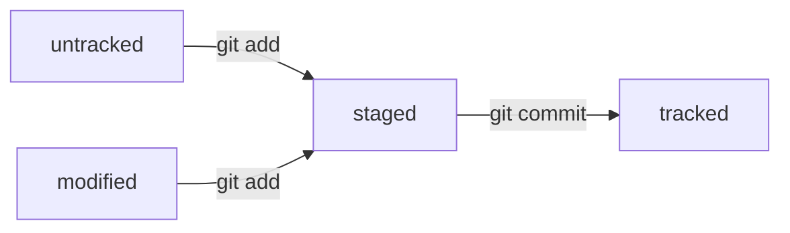
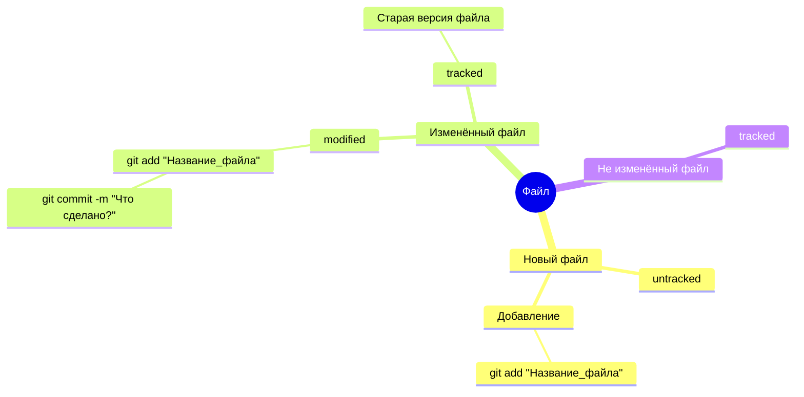
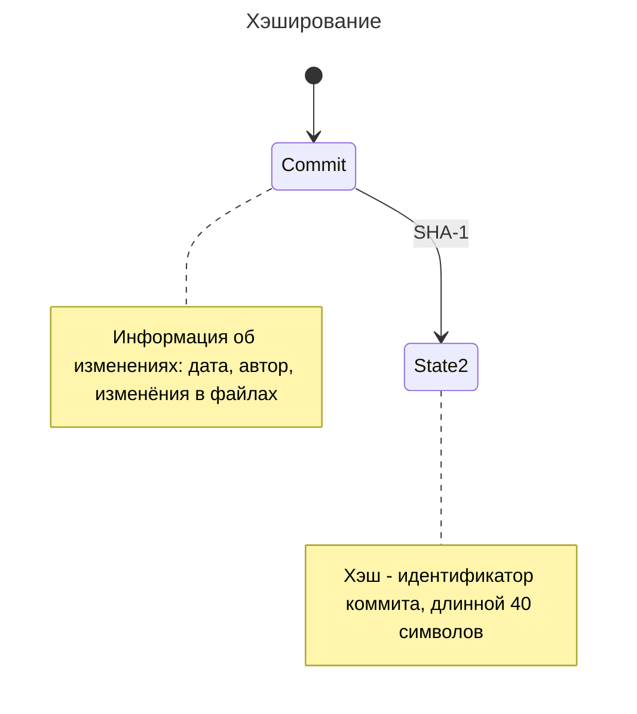

# Hey, it's cool tips for `Git`
---
[](https://nodesource.com/products/nsolid)
1. Используйте __Git__ для управления версиями проекта локально
2. Синхронизируйте локальные проекты с различными репозиториями, такими как __GitHub__
3. Работайте на проектом в команде

### Хороший гайд по Git: [Atlassian Git Tutorial](https://www.atlassian.com/git/tutorials/rewriting-history)

## Создание и подключение
##### Рассмотрим все шаги детально:
---
### На __windows__ локальные репозитория могут храниться тут:
```bash
cd ~/source/repos/
```
##### -🗂️ Тут обычно храняться все локальные репозитории __Git__
[](https://postimg.cc/ftVqsrr1)

### Инициализация крутого репозитория
```bash
git init
```
##### - 🗺️ Команда выполняется непосредственно в начальной директории проекта

### 💾 Добавим файлы с изменениями, это как __ctrl+c__
```bash
git add [Название_файла | .]
```

### 🔗 Объеденим все изменения
```bash
git commit -m "Что объединяет изменения?"
```

### Поделимся актуальной версией с удалённым репозиторием
```bash
git push
```

> [!WARNING] 
> Первое добавление на __GitHub__
> Если на удалёном репозитории ещё пусто, тогда `git remote add origin [git@github.com:username/Имя_репозитория.git]`
> Проверь, что репозитории связались `git remote -v`
> Затем, `git push -u origin [master | main]`

# Статусы файлов
---


```mermaid
graph LR;
untracked -- "git add" --> staged;
modified -- "git add" --> staged;
staged -- "git commit" --> tracked;
```


```mermaid
mindmap
  root((Файл))
    Новый файл
      untracked
      ::icon(fa fa-book)
      Добавление
        git add "Название_файла"
    Изменённый файл
      modified
        git add "Название_файла"
            git commit -m "Что сделано?"
      tracked
        Старая версия файла
    Не изменённый файл
      tracked

```

> Историю логов можно просмотрев git log --oneline

# __HEAD__ && __HASH__
---


```mermaid
---
title: Хэширование
---
stateDiagram-v2
    [*] --> State1

    State1: Commit
    note right of State1
        Информация об изменениях: дата, автор, изменёния в файлах
    end note
    State1 --> State2: SHA-1
    note right of State2
        Хэш - идентификатор коммита, длинной 40 символов
    end note

```

```bash
cd [Project_folder]/.git && cat HEAD
```
### Покажет ссылку на файл с ссылкой на самый последний (новый) коммит
[](https://postimg.cc/pptfH4mR)

### В этой директории находятся ссылки на самые последние коммиты из всех веток
[](https://postimg.cc/wtsM3xrP)

### ✍️ Переписываем последний коммит 
```bash
git commit --amend [-m "Новое сообщение"] | [--no-edit {оставит прежнее сообщение}]
```
> [!TIP]
> С помощью этой команды новое изменение __git add__ перепишет последний коммит __HEAD__, при этом стоит убедится что изменения находятся в __staging area__

## __Git reset__ $$ __Git restore__
### Добавьте следующую команду, чтобы откатить файл из __Staging area__ в __modified__
---
```bash
git restore --staged "Наименование файла"
```
##### Файл перейдёт в состояние __modified__

### Следующая команда поможет откатить файл в состояние последнего коммита из состояния __modified__
```bash
git restore "Наименование файла"
```

### Следующая команда откатывает все файлы к конкретному коммиту
```bash
git reset --hard "Хэш-коммита"
```

### __Git diff__ показывает разницу между коммитами
```bash
git diff [--staged] | [A B]
```
##### Команда без параметров покажет добавленные изменения в __modified__ файлах, если файл проиндексирован, то требуется добавить ключ ``` --staged ```. A и B это хэши сравниваемых коммитов

## __Git merge__
---
#### объединение веток выполняется в исходной ветки (в которую нуужно соеденить) командой `git merge <Наименование ветки>`
> [!TIP]
> После объединения веток старую ветку можно удалить с помощью `git branch -d <Название ветки>`

**Author: a1ndreay**
